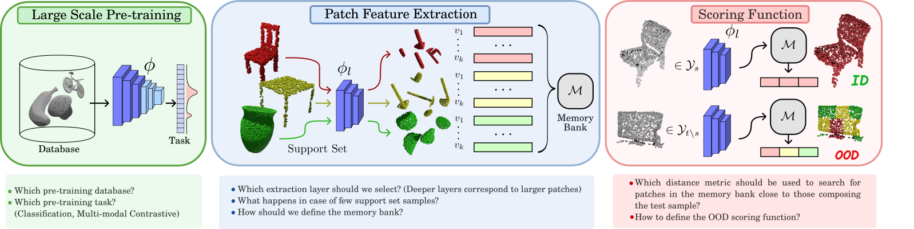

# 3DSend
This is the code repository for the [3D Semantic Novelty Detection
via Large-Scale Pre-Trained Models]([https://arxiv.org/abs/2310.03388](https://ieeexplore.ieee.org/document/10684168))



## Installation
```
pip install -r requirements.txt
```

if you want to perform experiments with EPN check [here](https://github.com/nintendops/EPN_PointCloud) for installing the backbone modules

## Data
For downloading the 3dos dataset follow the instructions at the [3dos repository](https://github.com/antoalli/3d_os) 

## Checkpoints
The main Uni3D checkpoints reported in the paper can be retrieved [here](https://huggingface.co/BAAI/Uni3D/blob/main/modelzoo/uni3d-b/model.pt)

The main OpenShape checkpoints reported in the paper are automatically downloaded from HuggingFace

Check [here](https://github.com/Colin97/OpenShape_code) for other OpenShape models and [here](https://github.com/baaivision/Uni3D) for other Uni3D models.

The EPN model trained on objaverse can be found [here](https://drive.google.com/drive/folders/1h8lklWrLr7Ox9n0hHn2zVOIl1i6rUS9j?usp=drive_link)

## Launch Experiments

To launch 3DSend experiments use the [send3d_launcher.py](send3d_launcher.py) file
```
python send3d_launcher.py --in_dataset Syn2Real_SR2 \
                          --data_path /data/datasets/3D_OS_release_data \
                          --model_zoo_path ./checkpoints \
                          --backbone OpenShape_Bert \
                          --layer ppat.transformer.layers.11.2 \
                          --num_points 2048 \
                          --sample_rate 1 \
                          --normalize 
```
```
python send3d_launcher.py --in_dataset Syn2Real_SR2 \
                          --data_path /data/datasets/3D_OS_release_data \
                          --model_zoo_path ./checkpoints \
                          --backbone uni3d-b \
                          --layer point_encoder.visual.blocks.11.mlp.fc2 \
                          --num_points 2048 \
                          --sample_rate 1 \
                          --normalize 
```


```--in_dataset``` is used to choose the in-distribution dataset, check [ood_datasets.py](data/ood_datasets.py) for possible choices

```--data_path``` defines the location to the 3DOS dataset

```--model_zoo_path``` defines the location where to automatically load checkpoints (avaiable only for uni3d)

```--layer``` defines the extraction layer

```--num_points``` defines the number of points present in the loaded pointclouds

```--sample_rate``` sets the coreset subsamling percentage, 1 means no subsampling

```--normalize``` is used to set cosine embedding distance, otherwise l2 distance is used

```--checkpoint-path``` specifies a checkpoint to be loaded manually, overwrites previous automatical loadings if specified

for more details use 
```
python send3d_launcher.py --help
``` 

## Add Other Networks

3D Send isn't bound to network architecture or pretraining, other networks can be added to the network list [here](networks/__init__.py)


### Citation

Currently under review

```
@ARTICLE{Rabino3dsend,
  author={Rabino, Paolo and Alliegro, Antonio and Tommasi, Tatiana},
  journal={IEEE Access}, 
  title={3D Semantic Novelty Detection via Large-Scale Pre-Trained Models}, 
  year={2024},
  volume={12},
  pages={135352-135361}}
```


